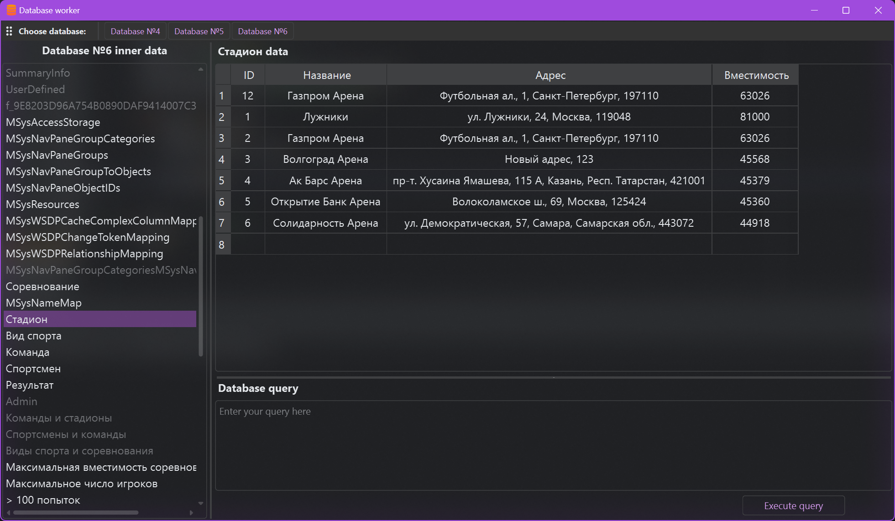

# Python MS Access UI

### Цель проекта — создание интерфейса для работы с MS Access базами данных со следующим функционалом:

- Просмотр доступных в базе данных таблиц и запросов
- Исполнение сохранённых запросов, в том числе параметризованных
- Редактирование данных таблиц непосредственно в ячейках
- Удаление строк таблиц выделением и нажатием Delete
- Исполнение SQL-запросов, введённых пользователем

### Скриншот интерфейса

